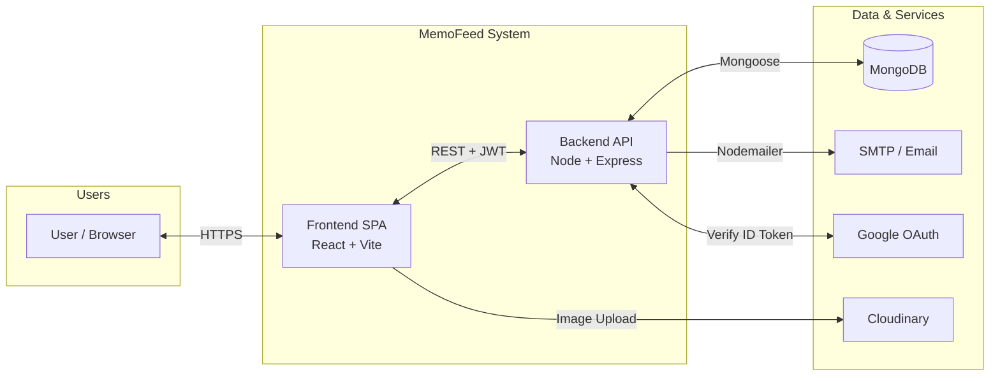
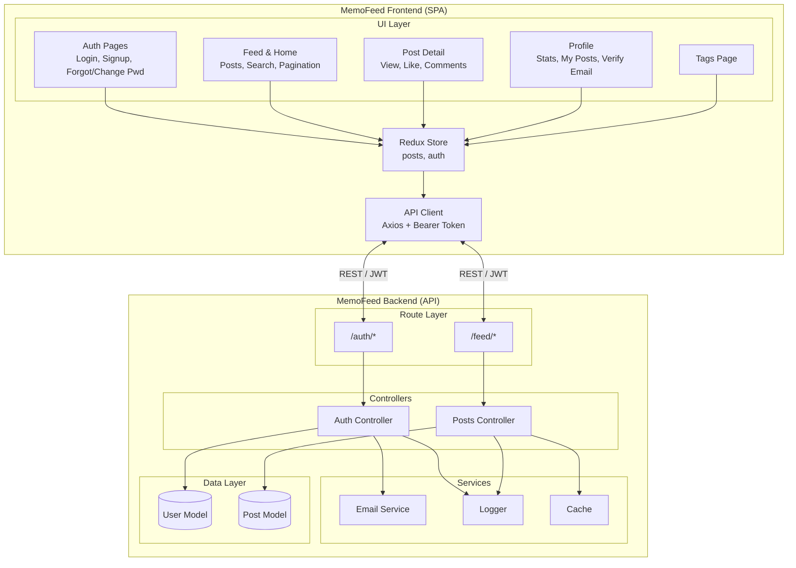
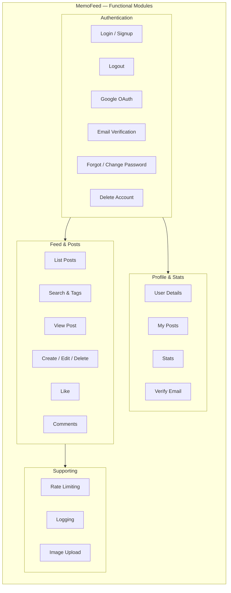
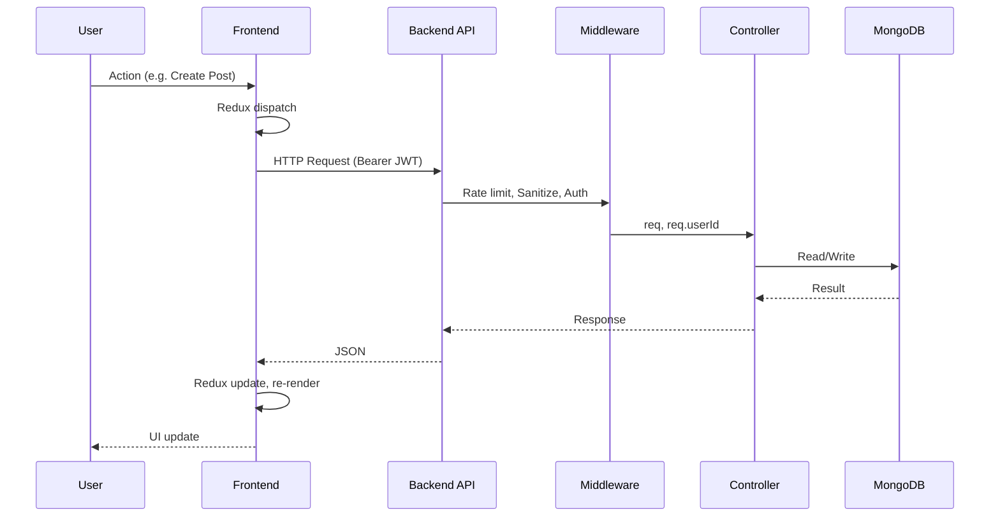
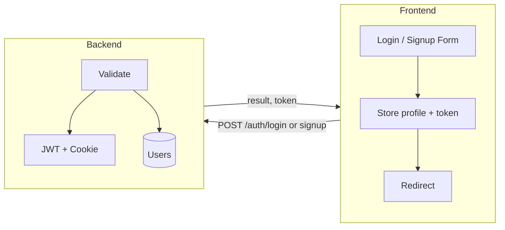
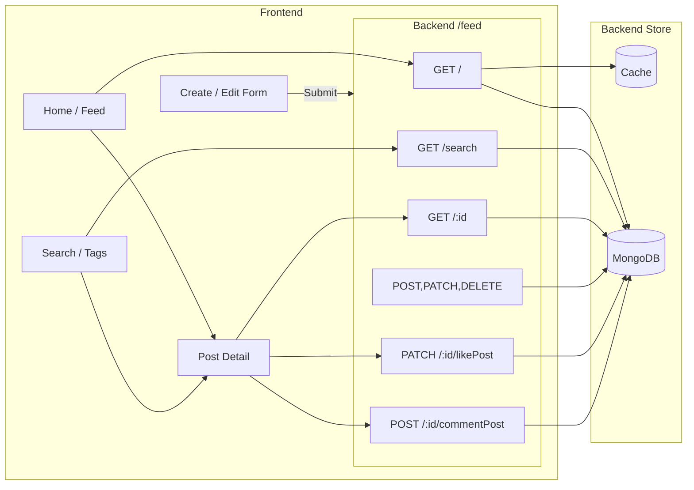
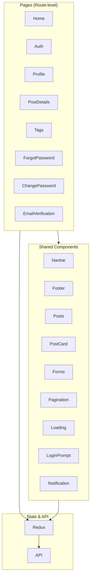
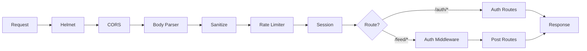

# MemoFeed — High-Level Functional Design

**Document:** High-Level Functional Design Diagram  
**Project:** MemoFeed (Medium-style social media application)  
**Version:** 1.0  
**Last Updated:** March 14, 2026  

This document provides high-level functional design diagrams for the MemoFeed system. Use a Markdown viewer that supports Mermaid (e.g. GitHub, VS Code with Mermaid extension, or [mermaid.live](https://mermaid.live)) to render the diagrams.

---

## 1. System Context Diagram

Shows the MemoFeed system and its external actors and systems.

---

## 2. High-Level Functional Architecture

Frontend and backend functional areas and how they connect.

---

## 3. Functional Modules Overview

Grouping of features by domain.

---

## 4. End-to-End Data Flow (Simplified)

Request flow from user action to database and back.

---

## 5. Auth Flow (High-Level)

---

## 6. Feed / Post Flow (High-Level)

---

## 7. Component Layering (Frontend)

---

## 8. Backend Request Pipeline

---

## Diagram Summary

| Diagram | Purpose |
|---------|---------|
| **1. System Context** | System boundaries, users, and external dependencies (DB, email, Cloudinary, Google). |
| **2. Functional Architecture** | Frontend vs backend blocks and their connections. |
| **3. Functional Modules** | Feature grouping: Auth, Feed, Profile, Supporting. |
| **4. Data Flow** | Sequence from user action to DB and back. |
| **5. Auth Flow** | High-level login/signup and token handling. |
| **6. Feed/Post Flow** | How feed, search, detail, and CRUD interact with API and store. |
| **7. Frontend Layering** | Pages, components, and state/API. |
| **8. Backend Pipeline** | Middleware and routing order. |

*To view Mermaid diagrams: use GitHub, VS Code (Mermaid extension), or paste the code blocks into [mermaid.live](https://mermaid.live).*
